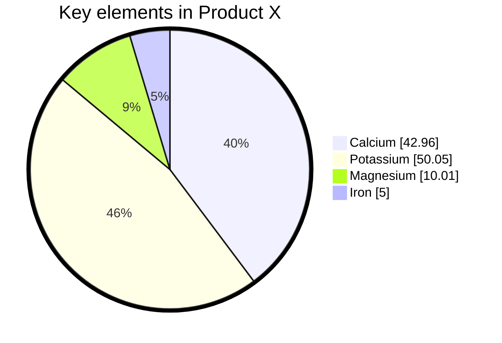

# H1
## H2
### H3 
#### H4
##### H5
###### H6


Párrafo cualquiera

Si queremos poner en **negrita**
o así __negrita__

Si queremos poner en *cursiva*

> ### Blockquote
> Podemos **anotar** cositas
> 1. dkfefdkm
> 2. efkmekf
> 
>⚠️ **Warning:** Do not push the big red button.


Listas ordenadas:
1. Sara
2. Miriam
3. Chari

Listas desordenadas:

- Manzana
- Pera
- Plátano
  - madurito 3
  - verde 2

Listas checks:

- [ ] Estudiar redes
- [x] Estudiar SSOO
- [ ] Lenguajes ejercicios

```html

<html>
    <head></head>
    <body></body>
    </html>

```
Linea horizonal:
---

Links:
[Guía de Markdown](https://www.markdownguide.org/)

Imágenes


Tablas:
|Nombre|Apelido1|Apellido2
|:-------:|:-------:|:--------:|
|Olga   | Moreno Martín|

|Jesús  | Heras | Palenzuela|

Nota al pie de página [^1]

[^1]: Este es el texto de pie de página


### Creando un ancla {#custom-id}
[Link custom-id](#custom-id) 
<!-- Este es el enlace al ancla -->

término
: definición

Texto tachado:
~~gkffgkh~~

H~2~O

H^2^

Párrafo
=======

texto ==subrayado==


tecla windows y el .
 ☠️🥶


 Mermaid:


 ```mermaid
 ---
title: Node
---
flowchart LR
    id

 ```


 ```mermaid
gantt
    title A Gantt Diagram
    dateFormat YYYY-MM-DD
    section Section
        A task          :a1, 2014-01-01, 30d
        Another task    :after a1, 20d
    section Another
        Task in Another :2014-01-12, 12d
        another task    :24d

 ```


 ```mermaid

 ---
title: Animal example
---
classDiagram
    note "From Duck till Zebra"
    Animal <|-- Duck
    note for Duck "can fly\ncan swim\ncan dive\ncan help in debugging"
    Animal <|-- Fish
    Animal <|-- Zebra
    Animal : +int age
    Animal : +String gender
    Animal: +isMammal()
    Animal: +mate()
    class Duck{
        +String beakColor
        +swim()
        +quack()
    }
    class Fish{
        -int sizeInFeet
        -canEat()
    }
    class Zebra{
        +bool is_wild
        +run()
    }

```




